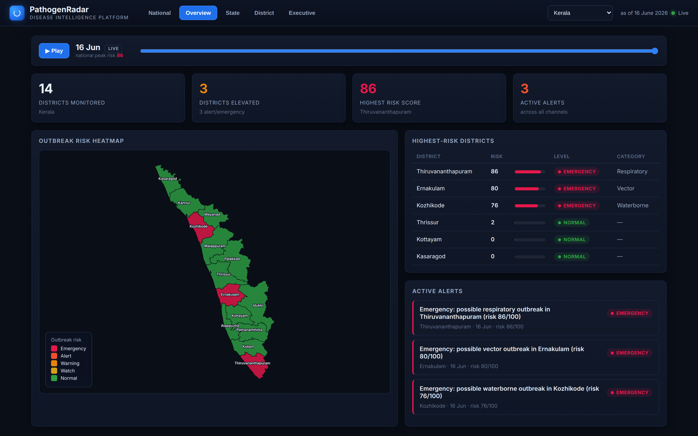
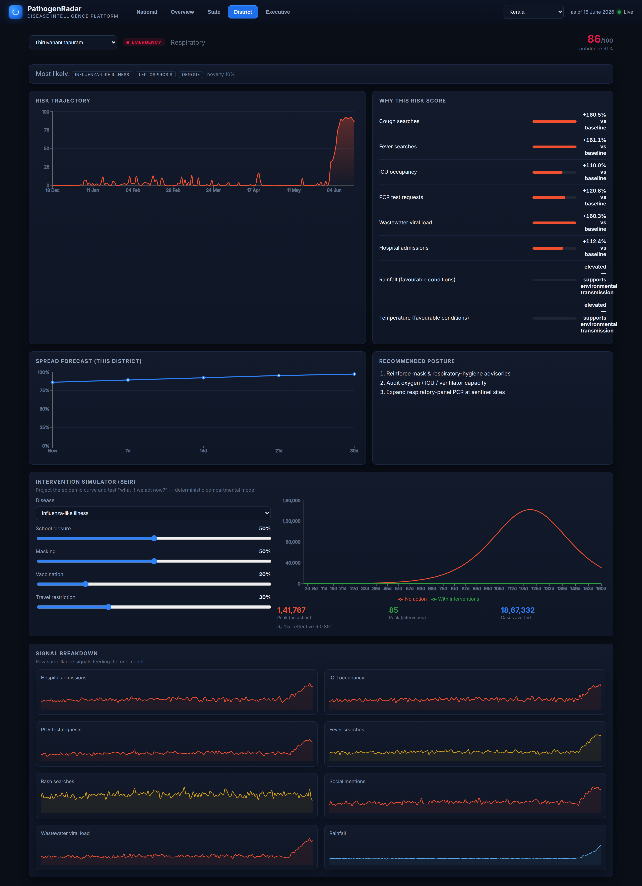
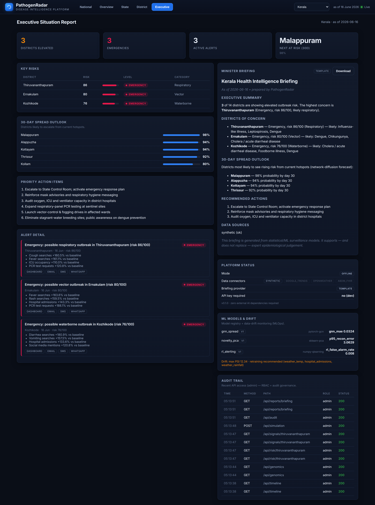
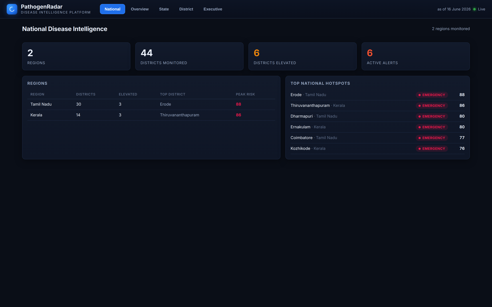
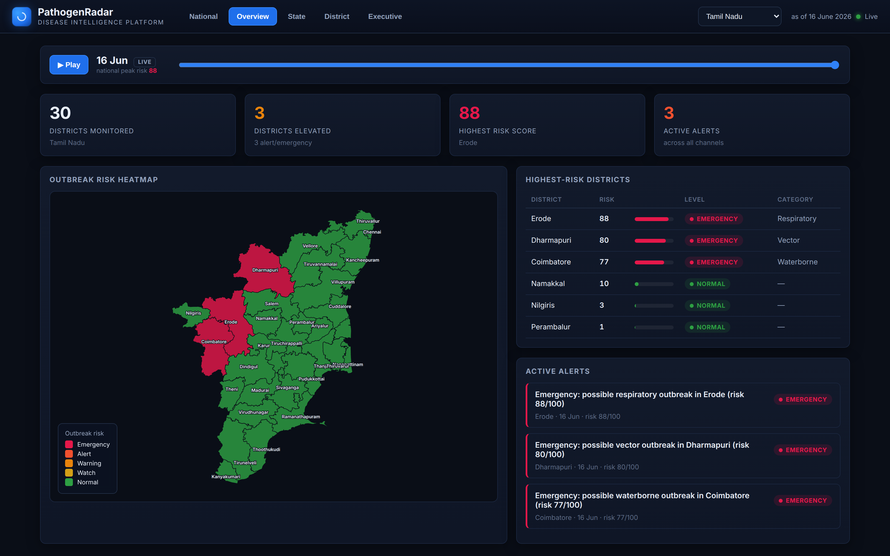

# PathogenRadar

> A government-grade **disease-intelligence platform**. Multi-region (Kerala + Tamil Nadu),
> with learned spread models, novel-pathogen detection, RBAC, MLOps and federated learning.

PathogenRadar turns raw public-health signals into executive decisions — detecting outbreaks,
forecasting spread, simulating interventions, and briefing decision-makers from a single
operating picture.



**The platform runs fully offline with zero external AI dependencies.** Forecasting, risk
scoring, alerting, spread prediction and simulation use deterministic / statistical / ML
models — never an LLM. Heavy ML (the GNN) is an *optional* dependency; everything degrades
gracefully. Optional plug-ins (real Google Trends, OpenWeather, ABDM/FHIR feeds, and LLM
briefing providers) are enabled via configuration but never required.

## The pipeline (raw signals → executive decision)

```
Acquire signals (synthetic + real Google Trends + weather + optional ABDM/FHIR)
  → data-quality scoring + per-source reliability + confidence
  → feature engineering (reliability-weighted multi-source fusion)
  → per-signal anomaly detection (search / hospital / social / wastewater)
  → fusion → unified district risk score
  → outbreak classification (IDF-weighted disease match) + novel-pathogen detection + explainability
  → spread forecast: deterministic graph diffusion OR learned GNN (beats baseline)
  → SEIR simulation (interventions + genomic variant coupling)
  → alerting (Watch…Emergency, escalation, RL-optimised timing)
  → minister briefing (templated; LLM optional)
  → React dashboard (National / Overview / State / District / Executive)
```

Run `make demo` for a narrated end-to-end walkthrough.

## Quick start

```bash
make install            # backend deps (.venv)
make seed               # generate data + run pipeline for ALL regions (multi scenario)
make api                # FastAPI backend at http://localhost:8000  (Swagger /docs)
make install-frontend && make dev-frontend   # dashboard at http://localhost:5173
make test               # backend test suite
```

Optional / advanced:

```bash
pip install -r requirements-ml.txt   # optional torch (for the GNN forecaster)
python scripts/train_gnn.py          # train the GNN spread model (beats deterministic baseline)
python scripts/train_rl.py           # train the RL alert-timing policy
python scripts/retrain.py            # retrain + register all models (MLOps)
python scripts/federated_demo.py     # federated-learning (FedAvg) vs centralized comparison
python scripts/mock_fhir_server.py   # mock ABDM/FHIR server (then set FHIR_BASE_URL)
```

## Screens

| District intelligence | Executive situation report |
| --- | --- |
|  |  |

| National roll-up (multi-region) | Tamil Nadu (auto-derived) |
| --- | --- |
|  |  |

The Overview has a **time-machine** to scrub/animate the outbreak's emergence; the District
view shows explainability, a live SEIR simulator, novelty flags and signal breakdown; the
Executive view delivers a minister briefing, platform status, the **model registry + drift**,
and the **audit trail**.

## Architecture

Everything is **region-aware and data-source agnostic** — adding a state is a config entry +
GeoJSON (Tamil Nadu's 30 districts are auto-derived: centroids, area-share populations,
shared-boundary adjacency). Key seams sit behind interfaces so heavier systems drop in:

| Interface | Today | Swappable to |
| --- | --- | --- |
| `Connector` | synthetic + Google Trends + OpenWeather + ABDM/FHIR | hospital/HL7/lab feeds |
| `KnowledgeGraphRepo` | NetworkX | Neo4j |
| `BriefingProvider` | Template (offline) | OpenAI / Anthropic / Gemini / Ollama |
| forecast model | deterministic diffusion | learned GNN (`FORECAST_MODEL=gnn`) |
| alerting policy | fixed thresholds | RL-tuned (`ALERTING_POLICY=rl`) |

```
backend/pathogenradar/
  acquisition/   M1  connectors (synthetic, google_trends, weather, fhir) + orchestration
  quality/       M2  missing/outlier/drift detectors, source reliability, confidence
  knowledge/     M3  disease knowledge graph (interface + NetworkX, IDF matching)
  features/          reliability-weighted multi-source aggregation
  signals/       M4  anomaly detectors (search STL+z, hospital IsolationForest, social, wastewater)
  fusion/        M5  detector fusion → risk score
  detection/     M6  level + category classification; M7 novelty (PCA autoencoder)
  explain/       M11 contribution breakdown
  forecast/      M8  deterministic diffusion + GNN (P2) over a mobility graph
  simulation/    M9  SEIR + interventions + metapopulation ground truth + variant coupling
  rl/            M10 Q-learning alert-timing optimisation
  alerting/      M14 escalation + recommended actions + channels
  llm/           M12 briefing provider abstraction (offline default)
  genomics/          synthetic variant surveillance feeding SEIR
  federated/         FedAvg simulation (privacy-preserving training)
  mlops/         M18 model registry + drift monitoring
  security/      M17 RBAC (viewer/analyst/minister/admin) + audit
  api/           M15 FastAPI (region-aware, paginated, error envelopes)
  pipeline.py        end-to-end orchestration ("the tick")
frontend/        M13 React + Vite + TS dashboard (SVG choropleth, Recharts, time-machine)
```

### Module → vision coverage

| Vision module | Status |
| --- | --- |
| M1 Acquisition · M2 Quality · M3 Knowledge graph · M4 Signal intelligence | ✅ |
| M5 Fusion · M6 Detection · M11 Explainability | ✅ |
| M7 Novel-pathogen detection | ✅ PCA autoencoder |
| M8 Spread forecast | ✅ deterministic **+ learned GNN** |
| M9 Simulator | ✅ SEIR + metapopulation + variant coupling |
| M10 RL decision | ✅ Q-learning alert optimisation |
| M12 LLM · M13 Dashboard · M14 Alerting · M15 API | ✅ |
| M17 Security | ✅ RBAC + audit (full ABDM/HIPAA = deployment) |
| M18 MLOps | ✅ registry + drift + retrain |
| Genomic surveillance · Multi-state · Federated learning | ✅ (synthetic/simulated) |
| Real govt/ABDM/hospital integrations | ◑ interface + **runnable mock**; production needs credentials |

## "Live vs simulated" (honest scoping)

A sandbox has no partner credentials or live feeds, so the following are **interface-correct +
runnable simulations**, clearly labelled, ready to swap to production sources:

- **ABDM/FHIR & hospital feeds** — real `Connector` + adapters + a mock FHIR server; set `FHIR_BASE_URL`.
- **Genomic surveillance** — synthetic variant frequencies that genuinely couple to SEIR.
- **Federated learning** — real FedAvg protocol across *simulated* clients (no node infra).

Everything else (multi-region, GNN, novel-pathogen, RL, RBAC, MLOps, time-machine, CI, tests)
is genuinely functional.

## Configuration (all optional)

| Variable | Effect |
| --- | --- |
| `PATHOGENRADAR_REGION` | Default region (`kerala`) |
| `ENABLE_GOOGLE_TRENDS` / `OPENWEATHER_API_KEY` | Enable real data connectors |
| `FHIR_BASE_URL` | Enable the ABDM/FHIR hospital connector |
| `FORECAST_MODEL` | `deterministic` (default) or `gnn` |
| `ALERTING_POLICY` | `fixed` (default) or `rl` |
| `LLM_PROVIDER` + `*_API_KEY` | Briefing provider (default `template`, no key) |
| `PATHOGENRADAR_API_KEY` / `PATHOGENRADAR_API_KEYS` | Enable auth + RBAC (`key:role,…`) |

## Roadmap (beyond this build)

Real government/ABDM/hospital integrations (credentials), live genomic feeds, multi-node
federated deployment, full HIPAA controls, and production infra (k8s, MLflow/Feast/Airflow).
The platform is the spine those assets plug into.
```
