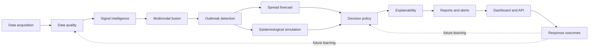
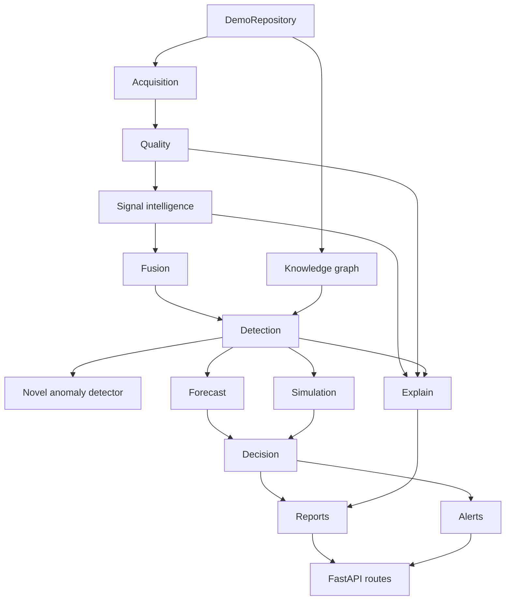
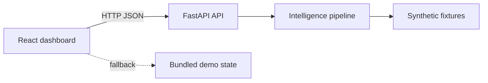

# Architecture

PathogenRadar is structured as layered disease intelligence infrastructure.
This repository implements a deterministic demo vertical slice where every
layer has a real interface and synthetic inputs.

## End-to-end intelligence loop

## Backend dependency graph

## Dashboard and API relationship

## Runtime modules

- **Data acquisition:** connector interfaces and synthetic connectors.
- **Data quality:** missing data, outlier, drift, integrity, and reliability
  scoring.
- **Signal intelligence:** deterministic source-specific encoders.
- **Knowledge graph:** fixture-backed disease/symptom/vector/weather graph.
- **Fusion:** weighted multimodal disease-state calculation.
- **Detection:** alert level and disease-category classification.
- **Novel anomaly:** deterministic novelty flag for unknown high-risk patterns.
- **Forecast:** graph propagation over district mobility edges.
- **Simulation:** simple deterministic SEIR-style intervention comparison.
- **Decision:** rule-based placeholder for a future RL policy.
- **Explainability:** top source drivers and caveats.
- **LLM intelligence:** report generation only; no prediction logic.
- **Alerts:** escalation payloads and channel readiness metadata.
- **Security/audit:** demo API-key and audit scaffolding.
- **Research mode:** safe predefined demo queries.

## Production extension points

- Replace demo connectors with hospital, ABDM, search, social, environmental,
  mobility, and wastewater integrations.
- Replace fixture knowledge graph with Neo4j.
- Replace baseline detectors with trained temporal, transformer, and anomaly
  models.
- Replace rule policy with governed RL optimization after outcome data exists.
- Add feature store, model registry, drift monitoring, and retraining pipelines.
